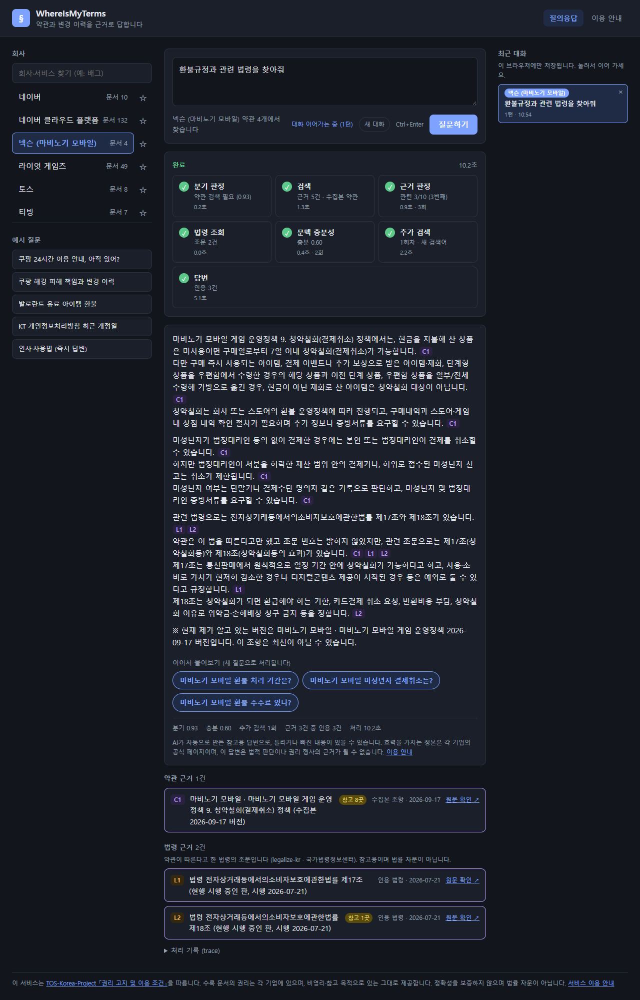
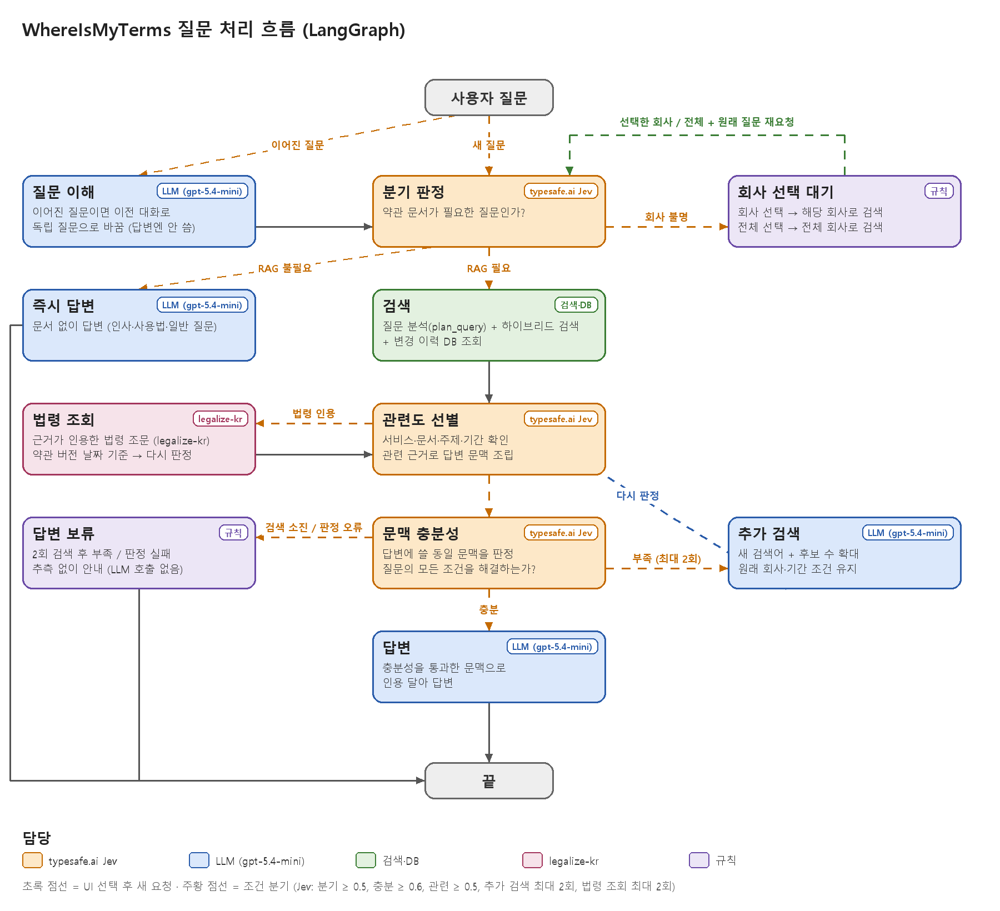

# WhereIsMyTerms

한국 온라인 서비스 약관이 **언제, 어떻게, 누구에게 불리하게** 바뀌었는지 추적하고, 약관과 변경 이력을 근거로 질문에 답하는 프로젝트입니다.

## 무엇을 하나요

- **변경 추적:** 약관을 조항 단위로 나누고 버전 사이의 추가·수정·삭제를 찾습니다. 번호만 바뀐 조항이나 자리를 옮긴 조항도 같은 조항으로 이어서 한 조항의 전체 이력을 만듭니다.
- **유불리 지수:** 조항마다 사용자에게 얼마나 유리하거나 불리한지 −2 ~ +2로 매기고, 불리한 조항과 불리하게 바뀐 조항을 찾습니다.
  > ⚠️ 유불리 지수는 AI 판정 모델(typesafe.ai Jev)이 자동으로 매긴 **참고용 점수**입니다. **법적 판단이 아니며**, 약관이나 기업의 적법성·공정성을 평가하지 않습니다.
  - **검증:** 공정거래위원회 보도자료(2010–2026, 공공누리 제1유형)에서 공정위가 고치게 한 약관 조항과 고친 뒤 조항 794쌍을 모아 기준으로 삼았습니다.
    - 현재 채점 모델은 이 중 90%(95% 구간 86–93%)에서 고치기 전 조항을 더 불리하게 매겼습니다.
    - 공정위가 고친 조항의 평균 지수는 −0.68이고, 고친 뒤 조항은 평균 −0.03으로 거의 중립이었습니다.
    - 같은 조항을 다시 채점하면 점수가 ±0.37 안에서 달라집니다. 그래서 지수는 조항 하나의 절대 판정보다 개정 전후 비교에 더 믿을 만합니다.
    - 면책 조항은 잘 잡지만(88%), 환불·위약금처럼 법정 기준과 비교해야 하는 조항은 약합니다(47%).
    - 95% 구간은 보도자료 80건 단위로 다시 뽑는 부트스트랩으로 냈습니다. 비교 기준으로 쓴 약관 문장은 이 저장소에 싣지 않았습니다.
- **약관 질의응답 (RAG):** "쿠팡 24시간 이용 안내 아직 있어?", "KT는 내 위치정보를 제3자에게 줄 때 알려줘?" 같은 질문에 현재 조항과 변경 이력을 찾아 근거 번호를 달아 답합니다.
- **근거 판정:** 찾은 근거가 질문과 맞는지, 그 근거만으로 질문에 답할 수 있는지를 따로 판정합니다. 부족하면 다시 찾고, 끝내 부족하면 추측하지 않고 답변을 보류합니다.
- **인용 법령 조회:** 약관이 "개인정보 보호법 제17조에 따라"처럼 법령을 명시적으로 인용하면, 그 조문을 약관 버전 당시 시행 중이던 판으로 [legalize-kr](https://legalize.kr)에서 가져와 함께 판정합니다.

## 질문 처리 흐름

LangGraph로 구성했습니다. 판정(분기, 근거 관련도, 문맥 충분성)은 [typesafe.ai](https://typesafe.ai) Jev가, 글쓰기(검색어, 답변)는 LLM이 나눠 맡습니다. 그림은 코드의 그래프에서 바로 그립니다.

## 구성

| 영역 | 내용 |
|---|---|
| 데이터 | 약관 파일 하나가 문서, git 커밋 하나가 버전 ([TOS-Korea-Project](https://github.com/jinbumlee95/TOS-Korea-Project)) |
| 파이프라인 | 정규화·해시 → 조항 청킹 → 조항 diff → 유불리 채점 → 변경 판정 |
| 검색 | Chroma 벡터 검색 + BM25 하이브리드, 조항 변경 이력 DB (SQLite) |
| 흐름 | LangGraph, Jev 판정 + LLM 생성, legalize-kr 법령 조회 |
| 화면 | 표준 라이브러리 HTTP 서버 + SSE 단계별 진행 표시 |

## 약관 원문에 대해

이 저장소에는 **코드만** 있습니다. 약관 원문은 각 기업의 저작물이라 싣지 않았고, 분석 결과와 색인도 로컬에만 둡니다. 데이터는 TOS-Korea-Project의 「권리 고지 및 이용 조건」을 따릅니다. 답변과 유불리 지수는 AI가 자동으로 만든 참고 정보이며, 효력을 가지는 정본은 각 기업의 공식 페이지입니다. 법적 판단이나 법률 자문이 아닙니다.
